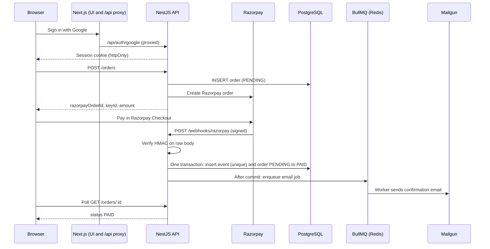

# Paid Order Pipeline

A small phone storefront where the money, the webhook and the notification all agree. A visitor browses products, signs in with Google, pays through Razorpay (test mode), and the order becomes **paid only when a signature-verified webhook says so**. A background job then sends a confirmation email, and the order status page flips from pending to paid on its own.

**Demo video (2 min):** [FILL: link or file name]
**Repository:** [FILL: GitHub URL]

## Stack

| Layer | Choice |
|---|---|
| Frontend | Next.js (App Router), TypeScript, Tailwind CSS |
| Backend | NestJS, TypeScript, Prisma 6, PostgreSQL 16 |
| Auth | Google OAuth via Passport in NestJS, own JWT in an httpOnly cookie |
| Payments | Razorpay (test mode) |
| Email | Mailgun (REST API, sandbox domain) |
| Queue | BullMQ on Redis 7 |

## Architecture



Next.js only renders pages and proxies `/api/*` to NestJS (so the session cookie stays same-origin). All business logic lives in NestJS.

## Quick start (under 5 minutes)

**Prerequisites:** Node.js 20+, Docker, a Google Cloud OAuth client, Razorpay test keys, a Mailgun sandbox domain.

**1. Start Postgres and Redis**

```bash
docker compose up -d
```

This also creates a second database, `heva_test`, used by the e2e tests.

**2. Environment files**

```bash
cp apps/api/.env.example apps/api/.env
cp apps/web/.env.example apps/web/.env.local
```

Fill in `apps/api/.env`:

| Variable | Where to get it |
|---|---|
| `DATABASE_URL`, `DATABASE_URL_TEST`, `REDIS_URL` | Defaults match `docker-compose.yml` |
| `JWT_SECRET` | Any long random string (`openssl rand -hex 32`) |
| `JWT_EXPIRES_IN` | Session lifetime, default `1d` |
| `WEB_URL` | `http://localhost:3000` |
| `GOOGLE_CLIENT_ID`, `GOOGLE_CLIENT_SECRET` | Google Cloud Console, APIs and Services, Credentials. Put the consent screen in Testing mode and add your Google account as a test user |
| `GOOGLE_CALLBACK_URL` | `http://localhost:3000/api/auth/google/callback` (register this exact URL as an authorized redirect URI) |
| `RAZORPAY_KEY_ID`, `RAZORPAY_KEY_SECRET` | Razorpay dashboard in **Test Mode**, Settings, API Keys (key id starts with `rzp_test_`) |
| `RAZORPAY_WEBHOOK_SECRET` | Any string you choose. Use the same value in the Razorpay dashboard webhook (optional, see below) |
| `MAILGUN_API_KEY` | Mailgun, Sending, Domain settings, API keys |
| `MAILGUN_DOMAIN` | Your sandbox domain, like `sandboxXXXX.mailgun.org` |
| `MAILGUN_API_URL` | `https://api.mailgun.net` (EU accounts: `https://api.eu.mailgun.net`) |
| `EMAIL_FROM` | For example `Heva Store <postmaster@sandboxXXXX.mailgun.org>` |
| `ADMIN_API_KEY` | Any string. Sent as the `x-admin-key` header to read failed jobs |

`apps/web/.env.local`:

| Variable | Value |
|---|---|
| `API_INTERNAL_URL` | `http://localhost:4000` |
| `NEXT_PUBLIC_SITE_URL` | `http://localhost:3000` |

> **Mailgun sandbox note:** a sandbox domain only delivers to *authorized recipients*. In the Mailgun dashboard, open your sandbox domain, add your email under Authorized Recipients, and click the verification link Mailgun sends you. Sign in with that same email address when testing, or the email will be rejected.

**3. Run the API**

```bash
cd apps/api
npm install
npx prisma migrate deploy
npx prisma db seed
npm run start:dev
```

The API listens on `http://localhost:4000`.

**4. Run the web app** (new terminal)

```bash
cd apps/web
npm install
npm run dev
```

Open `http://localhost:3000`. Note that `next build` fetches products at build time, so the API must be running for a production build.

## Trigger a webhook without a tunnel (replay script)

Razorpay cannot reach `localhost`, so `scripts/replay-webhook.ts` signs a payload with your webhook secret and posts it to the local API, exactly like Razorpay would.

1. Buy a product in the UI. The order stays **PENDING**.
2. Find its Razorpay order id and amount:

   ```bash
   docker exec -it heva-postgres psql -U heva -d heva -c "select razorpay_order_id, amount_paise, status from orders order by created_at desc limit 5;"
   ```

3. From the **repo root**, replay a successful payment (use the exact `amount_paise`):

   ```bash
   npm install            # first time only: installs ts-node and dotenv for the script
   npx ts-node -T scripts/replay-webhook.ts --order order_XXXX --amount 7990000 --event payment.captured
   ```

   Expected output: `#1 -> 200 {"result":"processed"}`. The status page flips to **PAID** within a few seconds and the email job runs.

**Replay the same event twice (idempotency demo):**

```bash
npx ts-node -T scripts/replay-webhook.ts --order order_XXXX --amount 7990000 --event payment.captured --event-id evt_demo --times 2
```

```
#1 -> 200 {"result":"processed"}
#2 -> 200 {"result":"duplicate"}
```

Then check the database: one event row, one paid order.

```bash
docker exec -it heva-postgres psql -U heva -d heva -c "select provider_event_id, status from webhook_events where provider_event_id='evt_demo';"
```

Other useful flags:

| Flag | Effect |
|---|---|
| `--bad-signature` | Flips one character of the signature. Expect HTTP 400 and no database change |
| `--event payment.failed` | Simulates a failed payment (order becomes FAILED) |
| `--order order_unknown` | Unknown order. Expect HTTP 503 and an `UNMATCHED` event stored for retry |
| `--amount <wrong>` | Amount mismatch. The event is ignored and the order is not paid |
| `--url <url>` | Send to a different endpoint |

## Real webhooks with ngrok (optional)

1. `ngrok http 4000`, then copy the `https://...ngrok-free.app` URL.
2. Razorpay dashboard (Test Mode), Settings, Webhooks, Add New Webhook:
   - URL: `https://<your-ngrok-url>/webhooks/razorpay`
   - Secret: the same value as `RAZORPAY_WEBHOOK_SECRET`
   - Events: `payment.captured`, `payment.failed`, `order.paid`
3. Pay in the UI and the status page flips to paid without any manual step.

The free ngrok URL changes on every restart, so update the dashboard URL each time.

## Razorpay test mode

- **Cards:** use a Razorpay test card (for example Visa `4718 6091 0820 4366`), any future expiry, any CVV.
- **UPI:** `success@razorpay` succeeds, `failure@razorpay` fails.
- **Netbanking and wallets:** pick any option. Razorpay shows a mock page with Success and Failure buttons.

See Razorpay's "Test Card Details" documentation for the full list.

## Tests

```bash
cd apps/api
npm run test        # unit tests (email processor, admin guard)
npm run test:e2e    # webhook tests against the real heva_test database
```

The webhook e2e tests use a fake queue and a real Postgres. They cover:

1. A valid signature marks the order paid.
2. An invalid signature is rejected and changes nothing.
3. The same event delivered twice gives one state change and one enqueued job.

Extra cases: unknown order returns 503 and the retry is processed later, `payment.failed` after PAID is ignored, a second event type for the same payment does not enqueue a second job, and an amount mismatch is ignored.

## API overview

| Endpoint | Auth | Purpose |
|---|---|---|
| `GET /products`, `GET /products/:slug` | Public | Catalog |
| `GET /auth/google`, `GET /auth/google/callback` | Public | Google sign-in flow |
| `GET /auth/me`, `POST /auth/logout` | Cookie | Current user, sign out |
| `POST /orders` | Cookie | Create a pending order and a Razorpay order |
| `GET /orders`, `GET /orders/:id` | Cookie | Current user's orders only |
| `POST /webhooks/razorpay` | Signature | Razorpay webhook (public, HMAC verified) |
| `GET /admin/failed-jobs` | `x-admin-key` | Permanently failed email jobs |

## Design decisions

- **Single source of truth.** Only `WebhooksService` writes `status = PAID`. The frontend's checkout callback only navigates to the status page. There is no endpoint that marks an order paid.
- **Raw body and HMAC.** Razorpay's signature is computed over the exact bytes it sent. NestJS is created with `rawBody: true` and the handler verifies `req.rawBody` with HMAC-SHA256 and `crypto.timingSafeEqual`. Re-serialized JSON can differ, so a parsed body cannot be verified reliably.
- **Idempotency in the database.** `webhook_events` has `UNIQUE(provider, provider_event_id)`. The handler inserts with `ON CONFLICT DO NOTHING` and checks the affected row count, so two identical deliveries, even simultaneous ones, produce one state change.
- **Unmatched events.** If the order cannot be found, the event is stored as `UNMATCHED` and the endpoint returns 503. Razorpay retries with the same event id, and an `UNMATCHED` event is processed on retry instead of being dropped as a duplicate.
- **Conditional update.** `UPDATE orders SET status='PAID' WHERE id=? AND status IN ('PENDING','FAILED')`. PAID is terminal, so late or repeated events cannot undo it. FAILED may become PAID because Razorpay lets a customer retry a failed payment on the same order. The payment amount is also checked against the order amount.
- **Queue.** The job is enqueued *after* the transaction commits. BullMQ runs it with 5 attempts, exponential backoff and a deterministic `jobId` (`email-<orderId>`). The processor also checks `confirmation_email_sent_at`, so a retried job does not send a second email.
- **Failure visibility.** Permanently failed jobs are written to the `failed_jobs` table and listed at `GET /admin/failed-jobs`.
- **Provider boundaries.** Payments and email sit behind abstract classes (`PaymentProvider`, `EmailProvider`, `EmailJobQueue`), so tests inject fakes.
- **Auth.** Google OAuth through Passport. We issue our own JWT in an httpOnly, SameSite=Lax cookie (Secure in production). OAuth `state` is bound to the browser with a short-lived cookie to stop login CSRF, and the post-login redirect is a fixed config value, never user input. The guard rejects missing, invalid or expired sessions with 401.
- **Prices.** The order amount always comes from the products table, never from the client. Money is stored as integer paise.
- **Rendering.** The product list is statically generated with `revalidate = 60`, because it is identical for everyone and changes rarely, so 60 seconds keeps it fast and fresh enough. The product detail page is server-rendered so each product has its own title, description, Open Graph tags and Product JSON-LD in the initial HTML. Orders pages are client components behind sign-in that poll until the status is paid or failed.
- **With 50,000 products:** paginate the list with server-side search, use ISR with on-demand generation for detail pages (only pre-render top sellers, revalidate by tag when a product changes), split the sitemap into chunks, and index the lookup columns.

## What is real and what is skipped

| Area | Status | Notes |
|---|---|---|
| Google OAuth | Real | Testing-mode consent screen, test users only |
| Razorpay | Real (test mode) | Real orders and real signed webhooks |
| Mailgun email | Real (sandbox) | Delivers to authorized recipients only |
| PostgreSQL, Redis, BullMQ | Real | Run through Docker Compose |
| Bonus integration (SMS or Zoho) | Skipped | Chose depth on the webhook, queue and tests |
| Refresh tokens, session revocation | Skipped | Stateless JWT with expiry. Logout only clears the cookie |
| Outbox pattern | Skipped | Known gap: a crash after commit but before enqueue leaves a paid order without an email job |
| Expiry of abandoned PENDING orders | Skipped | Would need a scheduled cleanup job |
| Admin UI for failed jobs | Skipped | API endpoint only |
| Rate limiting, refunds, inventory, multi-item carts | Skipped | Out of scope for 24 hours |
| Deployed URL | [FILL: Skipped or link] | Runs locally via Docker Compose |

## Lighthouse (mobile)

| Page | Performance | Accessibility | Best Practices | SEO |
|---|---|---|---|---|
| Product list `/` | [73] | [96] | [96] | [100] |
| Product detail `/products/apple-iphone-16` | [66] | [96] | [96] | [100] |

Run against a production build (`npm run build && npm run start`) in an incognito window. [FILL: one line on why any score is below target, if applicable.]


## Known limitations and next steps

- Add a transactional outbox, so the email job cannot be lost between commit and enqueue.
- At-least-once delivery means a worker crash between sending and marking the email could send a duplicate. Mailgun has no idempotency keys, so the window is small but real.
- Add a scheduled job to expire old PENDING orders.
- Add server-side session revocation and rate limiting.
- Build an admin screen for failed jobs, with a retry button.
- Deploy with a stable public webhook URL.

## Project structure

```
.
├── apps
│   ├── api                 NestJS backend
│   │   ├── prisma          schema, migrations, seed
│   │   ├── src
│   │   │   ├── admin       failed-jobs endpoint, admin key guard
│   │   │   ├── auth        Google strategy, state guard, JWT guard, controller
│   │   │   ├── config      env validation
│   │   │   ├── email       EmailProvider and Mailgun implementation
│   │   │   ├── orders      order creation and queries
│   │   │   ├── payments    PaymentProvider and Razorpay implementation
│   │   │   ├── prisma      Prisma module and service
│   │   │   ├── products    catalog endpoints
│   │   │   ├── queue       BullMQ queue, email processor
│   │   │   ├── users       user upsert and lookup
│   │   │   └── webhooks    signed, idempotent Razorpay webhook handler
│   │   └── test            webhook e2e tests
│   └── web                 Next.js frontend (UI only)
│       └── src
│           ├── app         pages: list (SSG), product detail (SSR), orders
│           ├── components  header, auth provider, buy button, order status
│           └── lib         API helpers, types, formatting
├── docs                    implementation guide, Lighthouse screenshots
├── scripts                 replay-webhook.ts
├── docker/init.sql         creates the test database
└── docker-compose.yml      Postgres 16 and Redis 7
```

Product photos are from Unsplash.